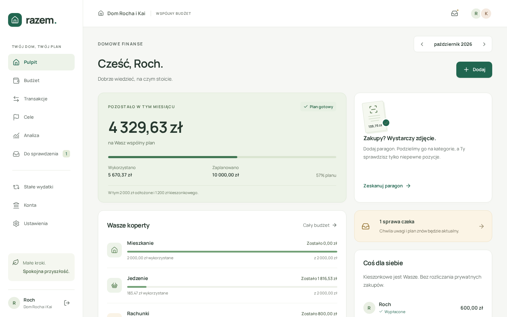
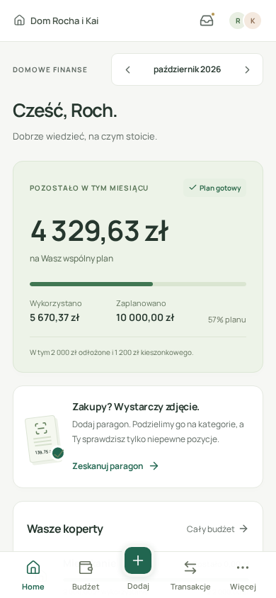

<div align="center">
  
  <h1>Razem.</h1>
  <p><strong>Spokojny budżet dla Waszego domu.</strong></p>
  <p>Wspólny plan. Szybkie wydatki. Paragon podzielony na właściwe koperty.</p>

[](https://github.com/RochZaremba/financialApp/actions/workflows/ci.yml)
[](https://github.com/RochZaremba/financialApp/releases)
[](apps/web/public/manifest.webmanifest)

[Otwórz aplikację](https://finance.rochzaremba.com) · [Uruchom lokalnie](#uruchomienie-lokalne) · [Wdrożenie](docs/CI_CD.md) · [Dokumentacja](#dokumentacja)
</div>

## Jeden wspólny plan, mniej wpisywania

Razem. to aplikacja do prywatnego budżetu gospodarstwa domowego. Dochód dostaje konkretne zadania: codzienne potrzeby, przyjemności, kieszonkowe i oszczędności. W każdej chwili widać, ile zostało na miesiąc i w poszczególnych kopertach.

- **Budżet miesięczny** — nazwane źródła dochodu przypisane do domowników, kategorie, kwoty do przydzielenia i historia miesięcy.
- **Wydatki i wpływy** — szybkie wpisy, podział na kilka kategorii, historia, edycja zapisanych transakcji i transfery między kontami. Korekty aktualizują salda i budżet; równoczesne zmiany wymagają odświeżenia. Dla zatwierdzonego paragonu można zmienić opis i konto, a dane dokumentu pozostają spójne.
- **Paragony z telefonu** — zdjęcie, OCR przez Gemini lub OpenAI, klasyfikacja każdej pozycji i przegląd niepewnych wyników. Błędy można poprawić; szkic zostaje zachowany.
- **Kieszonkowe** — po wypłacie prywatne zakupy nie wymagają rozliczania we wspólnym budżecie.
- **Cele i stałe płatności** — oszczędności, miesięczne wpłaty, oczekiwane rachunki i prosta prognoza.
- **Konta walutowe** — salda w PLN, EUR, USD, GBP i CHF; wspólna wycena w złotych po ostatnim opublikowanym kursie średnim NBP, z datą kursu.
- **Wspólny dom** — własne konta, zaproszenie domownika, prywatne dane, eksport i usuwanie gospodarstwa.
- **PWA** — polski interfejs, PLN, mobile/desktop i instalacja na ekranie telefonu.

W Budżecie dodaj osobno np. wynagrodzenie Rocha, wynagrodzenie Kai i dodatkowe zlecenia. Każde źródło ma nazwę, osobę (lub „Wspólny dochód”) i kwotę. Suma zasila plan tego miesiąca; rzeczywisty wpływ zapisujesz osobno w transakcjach. Źródła można zmieniać i usuwać, a poprzednie miesiące zachowują własne plany. Istniejący pojedynczy dochód zostaje zachowany jako „Dochód wspólny”.

Konto walutowe dodasz w „Konta → Dodaj konto”, wybierając walutę i saldo. Kursy odświeżają się automatycznie (cache do godziny); wycena nie jest kursem wykonania wymiany w banku. Przy awarii NBP widać ostatni pobrany kurs albo brak pełnej wyceny. Budżet, paragony i transakcje nadal prowadzicie na kontach PLN.

Kwoty są całkowitymi groszami (na kontach walutowych: setnymi częściami ich waluty). Podział transakcji musi odpowiadać jej sumie. Reguły klasyfikacji należą do konkretnego domu, a zdjęcia nie są publiczne ani przechowywane w cache PWA.

<p align="center">
  
  
</p>

Podglądy używają wyłącznie syntetycznych danych demonstracyjnych. Produkcja zaczyna się od własnego konta i pustego gospodarstwa.

## Uruchomienie lokalne

Wymagania: **Node.js 22+, Python 3.13+, Docker z Compose** oraz wolne porty 3000, 8000 i 5434.

```bash
git clone https://github.com/RochZaremba/financialApp.git
cd financialApp
./scripts/setup.sh
./scripts/dev.sh
```

Otwórz **http://localhost:3000**. Setup tworzy prywatny `.env`, instaluje zależności, stosuje migracje i przygotowuje syntetyczne dane Rocha i Kai. Wybierz „Zobacz wersję demo” albo utwórz własne konto. Demo pokazuje plan **października 2026**; w późniejszym miesiącu wybierz go w nagłówku.

Ctrl+C zatrzymuje web/API; baza i dane pozostają. Produkcyjne obrazy nie mają seeda ani przykładowego paragonu, a logowanie demo jest wyłączone.

### Odczyt paragonów przez AI

Bez klucza można zapisywać zdjęcia i uzupełniać szkice ręcznie. Lokalny tryb `fixture` rozpoznaje tylko dołączony syntetyczny paragon. Dla rzeczywistych zdjęć ustaw w prywatnym `.env`:

```dotenv
RECEIPT_PROVIDER=gemini
GEMINI_API_KEY=twoj_klucz
GEMINI_MODEL=gemini-3.1-flash-lite
```

Alternatywa: `RECEIPT_PROVIDER=openai`, `OPENAI_API_KEY`, `OPENAI_MODEL`. Zrestartuj API po zmianie. Wyniki obu usług są walidowane; suma i kategorie wymagają sprawdzenia przed zatwierdzeniem. Aktywny dostawca otrzymuje zdjęcie i kontekst kategorii; wywołania API mogą być płatne. Szczegóły: [obsługa i konfiguracja](docs/OPERATIONS.md).

## Testy

Zatrzymaj lokalne web/API, następnie:

```bash
PLAYWRIGHT_DOCKER=1 WEBKIT=1 ./scripts/check.sh
```

Pełna bramka obejmuje lint, typecheck, produkcyjny build, testy frontendowe/API, migracje, testy bezpieczeństwa deploymentu, E2E Chromium/WebKit i przegląd ekranów na czterech viewportach. Bazy i zdjęcia QA są oddzielne; testy nie wywołują płatnego OCR. Wyniki i zrzuty trafiają do ignorowanego `artifacts/`.

Testy przeglądarkowe używają oficjalnego obrazu Playwright dobranego do wersji z lockfile, tak samo jak CI. Na Linuxie kontener łączy się z lokalnymi serwerami przez host networking. Alternatywnie zainstaluj przeglądarki `npx playwright install --with-deps chromium webkit` i uruchom `WEBKIT=1 ./scripts/check.sh` bez kontenera przeglądarkowego.

## CI/CD

| Zdarzenie | Co się dzieje |
| --- | --- |
| Pull request do `main` | Pełne testy; bez kluczy produkcji |
| Push do `main` | Weryfikacja; bez wdrożenia i release |
| **Merge PR do `main`** | Ponowne testy → build ARM64 → produkcyjny smoke → backup → Oracle → healthcheck → GitHub Release |
| Zamknięcie PR bez merge | Bez wdrożenia i release |

Wydania zawierają obrazy API/web, identyfikator commita i sumy SHA-256. Klucze OCR, hasło PostgreSQL i dane domowników zostają na Oracle. Aktualizacje zachowują wolumeny; nieudany deployment przywraca poprzednie obrazy bez automatycznego downgrade bazy.

[Konfiguracja i obsługa CI/CD](docs/CI_CD.md) · [Oracle / Caddy / backupy](deploy/ORACLE.md) · [GitHub Releases](https://github.com/RochZaremba/financialApp/releases)

## Architektura

Modularny monolit: **Next.js + TypeScript + React Query + Tailwind** na froncie; **FastAPI + Pydantic + SQLAlchemy + Alembic + PostgreSQL** na serwerze. Opaque sessions z Argon2, prywatny storage paragonów i wymienny dostawca AI. Europe/Warsaw, PLN. Integracja bankowa pozostaje przyszłym źródłem transakcji.

```text
apps/web/       interfejs i PWA
apps/api/       API, domena, testy i migracje
fixtures/       syntetyczny paragon QA
scripts/        uruchomienie, weryfikacja i pakowanie release
deploy/        produkcja, Caddy i ograniczony odbiornik SSH
docs/adr/       decyzje architektoniczne
.github/        CI/CD, szablony i aktualizacje zależności
```

## Dokumentacja

- [Szczegółowe uruchomienie, OCR i migracje](docs/OPERATIONS.md)
- [CI/CD i aktualizacje produkcji](docs/CI_CD.md)
- [Decyzje architektoniczne](docs/adr/ADR.md)
- [Współpraca](CONTRIBUTING.md) · [Bezpieczeństwo](SECURITY.md)
- [Kryteria jakości](docs/quality/ACCEPTANCE.md) · [przebiegi review](docs/quality/LOOP_LOG.md)

To aplikacja do domowego budżetu. V1 nie obejmuje PSD2, automatycznego importu bankowego ani księgowości podatkowej.
